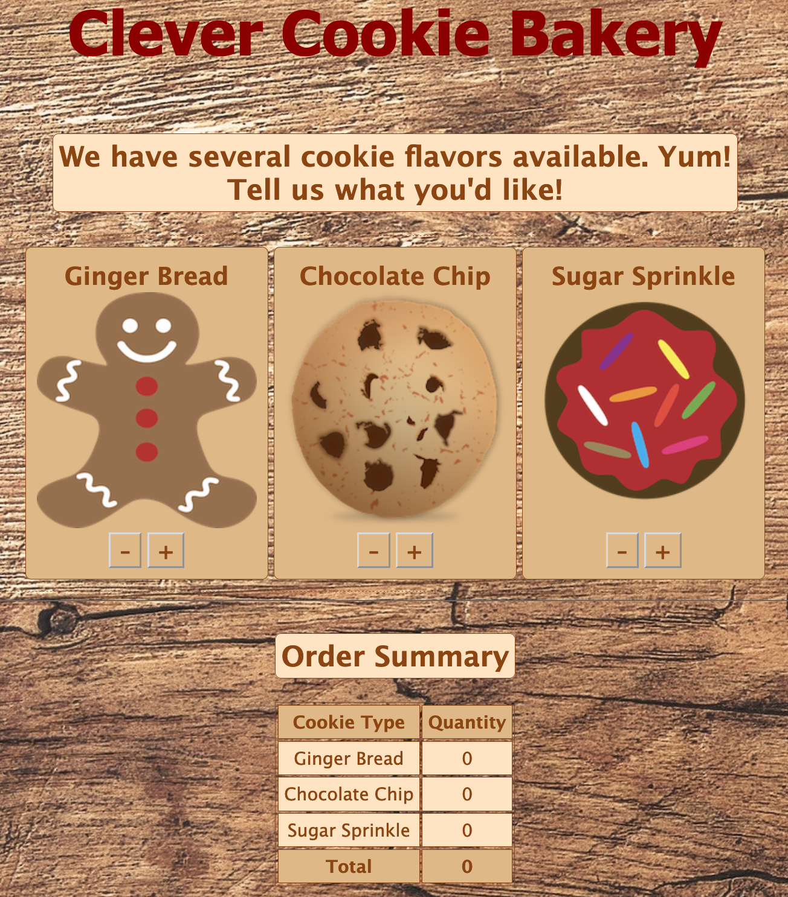

# Placement Exam (Starter Code)

Use this code as a basis for your placement exam. As always, read through the code you have before starting to write any new code. And remember, **there are no criteria that require you to alter the HTML or CSS**. You *can* alter it. We won't stop you, but we'd recommend leaving it until later. 

**Your job is to write the JavaScript code that will bring this mini-website to life!**

Success Criteria
 [x] The Created By h2 element above the footer says Created By [YOUR NAME] instead of Created By Jane Doe, where [YOUR NAME] represents your real name.
 [x] The +1 and –1 buttons are clickable for each cookie (six buttons total).
 [x] The +1 button for each cookie adds one to the appropriate cookie count (three criteria).
 [x] The –1 button for each cookie subtracts one from the appropriate cookie count (three criteria).
 [x] The table updates the appropriate table cell when each cookie is added or subtracted (three criteria).
 [x] The table updates the total cell in the footer that tallies all the cookies.

Bonus Criteria
 [] If you are finished and ready for a challenge, try the bonus below:

 [x] Do not allow the number of cookies to be less than zero (three criteria).